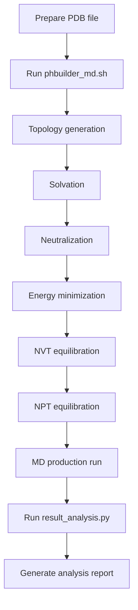

# Constant pH Molecular Dynamics Simulation and Analysis Project

## Project Overview

This project provides a complete toolkit for constant pH molecular dynamics simulations and result analysis, primarily designed to study protein conformational changes and dynamic behavior under different pH conditions. The project includes two core scripts:

- **`phbuilder_md.sh`**: Automated constant pH molecular dynamics simulation pipeline
- **`result_analysis.py`**: High-quality result analysis and visualization tool

## Key Features

### Simulation Script (`phbuilder_md.sh`)
- ✅ Complete constant pH MD simulation workflow automation
- ✅ GPU acceleration support (specially optimized for RTX 4090)
- ✅ Intelligent CPU core management and multi-task support
- ✅ Flexible command-line parameter configuration
- ✅ Batch processing mode for multiple pH conditions
- ✅ Detailed logging and error handling

### Analysis Script (`result_analysis.py`)
- ✅ Publication-quality high-resolution chart generation
- ✅ RMSD/RMSF statistical analysis
- ✅ Protein pocket region flexibility analysis
- ✅ Statistical comparison of multiple experimental datasets
- ✅ 600 DPI high-resolution output

## Dependencies

### Required Software

1. **pHbuilder** (GPU version)
   - For constant pH molecular dynamics simulations
   - ⚠️ **Important**: GPU version must be installed for optimal performance

2. **GROMACS** (compatible version with pHbuilder)
   - Molecular dynamics simulation engine
   - GPU acceleration support required

3. **Python 3.7+**
   - For result analysis and visualization

### Python Dependencies

```bash
pip install numpy matplotlib pandas seaborn scipy
# Optional: for detailed trajectory analysis
pip install MDAnalysis
```

### Hardware Recommendations

- **GPU**: NVIDIA RTX 4090 or other compatible CUDA GPUs
- **CPU**: Multi-core processor (16+ cores recommended)
- **Memory**: 32GB+ RAM (depending on system size)

## Installation Guide

### 1. pHbuilder Installation

**Important Notice**: You MUST install the GPU version of pHbuilder!

Please follow the official tutorial for installation:
```
https://gitlab.com/gromacs-constantph/phbuilder
```

**Installation Overview**:
1. Visit the GitLab page above
2. Follow the detailed instructions in the README
3. **Make sure to select the GPU version during compilation**
4. Verify the installation is successful

### 2. Environment Activation

After installation, you need to activate the pHbuilder environment before each use:

```bash
# Activate pHbuilder environment (adjust path according to your installation)
source /opt/software/gromacs-constantph-gpu/env.sh
```

### 3. Download Project Scripts

```bash
# Download project scripts
chmod +x phbuilder_md.sh  # Grant execution permission
```

## Usage Instructions

### 1. Prepare Input Files

Ensure you have the following files:
- **Protein PDB file** (e.g., `protein.pdb`)
- **GROMACS parameter files** (`.mdp` files)

### 2. Run Molecular Dynamics Simulation

#### Basic Usage

```bash
# Activate environment
source /opt/software/gromacs-constantph-gpu/env.sh

# Run single simulation
./phbuilder_md.sh -p protein.pdb --ph 6.0 --box 1.5
```

#### Advanced Usage

```bash
# Specify GPU and CPU settings
./phbuilder_md.sh -p protein.pdb --ph 6.0 --box 1.5 --gpu 0 --cpu-offset 0

# Multi-task parallel execution (different terminals)
# Terminal 1:
./phbuilder_md.sh -p protein1.pdb --ph 6.0 --box 1.5 --cpu-offset 0
# Terminal 2:
./phbuilder_md.sh -p protein2.pdb --ph 6.0 --box 1.5 --cpu-offset 12
# Terminal 3:
./phbuilder_md.sh -p protein3.pdb --ph 6.0 --box 1.5 --cpu-offset 24

# Batch processing mode
./phbuilder_md.sh --batch
```

#### Command Line Parameters

| Parameter | Description | Example |
|-----------|-------------|---------|
| `-p, --pdb` | Input PDB file | `protein.pdb` |
| `--ph` | pH value | `6.0` |
| `--box` | Box distance | `1.5` |
| `--gpu` | GPU device ID | `0` or `0,1` |
| `--cpu-offset` | CPU core offset | `0`, `12`, `24` |
| `--no-gpu-md` | Disable GPU for MD stage | - |
| `--batch` | Batch processing mode | - |
| `--suggest-cpu` | Show CPU allocation suggestions | - |

### 3. Result Analysis

After simulation completion, use the analysis script to generate high-quality reports:

```bash
# Basic analysis
python result_analysis.py -d pH6_run1 pH6_run2 pH6_run3 -p 243 105 129

# Multiple directory analysis
python result_analysis.py -d exp1 exp2 exp3 -p 100 200 300

# Specify output formats
python result_analysis.py -d pH4_1 pH4_2 pH4_3 -p 243 105 129 --formats png pdf
```


#### Analysis Parameters

| Parameter | Description | Example |
|-----------|-------------|---------|
| `-d, --directories` | Analysis directory list | `pH4_1 pH4_2 pH4_3` |
| `-p, --pocket-centers` | Pocket center residue numbers | `243 105 129` |
| `--output-suffix` | Output file suffix | `_pH6` |
| `--formats` | Output formats | `png pdf svg` |

## Workflow



## Output Files

### Simulation Output Files
- `MD.pdb`: Final structure
- `MD.xtc`: Trajectory file
- `rmsd.xvg`: RMSD analysis data
- `rmsf.xvg`: RMSF analysis data
- `logs/`: Detailed log files

### Analysis Output Files
- `comprehensive_md_analysis_pH*.png`: Comprehensive analysis report (600 DPI high-resolution)
- Contains RMSD, RMSF, pocket analysis, and statistical summary

## Performance Optimization

### GPU Configuration
- **RTX 4090**: Use default optimization settings
- **Other GPUs**: Adjust parameters based on VRAM capacity

### CPU Configuration
- **54-core system**: Supports up to 4-5 parallel tasks
- **Multi-task execution**: Use `--cpu-offset` to avoid resource conflicts

### Memory Optimization
- Large systems (>100k atoms): Recommend 64GB+ RAM
- Small systems (<50k atoms): 32GB RAM usually sufficient

## Troubleshooting

### Common Issues

1. **Environment not activated**
   ```bash
   # Solution: Activate environment before each run
   source /opt/software/gromacs-constantph-gpu/env.sh
   ```

2. **GPU not available**
   ```bash
   # Check GPU status
   nvidia-smi
   # Use CPU mode
   ./phbuilder_md.sh -p protein.pdb --ph 6.0 --box 1.5 --no-gpu-md
   ```

3. **File permission issues**
   ```bash
   chmod +x phbuilder_md.sh
   ```

4. **Missing Python dependencies**
   ```bash
   pip install numpy matplotlib pandas seaborn scipy
   ```

### Getting Help

```bash
# View simulation script help
./phbuilder_md.sh --help

# View analysis script help
python result_analysis.py --help

# Get CPU allocation suggestions
./phbuilder_md.sh --suggest-cpu
```

## Contribution and Support

If you encounter issues or have suggestions for improvement:

1. Check pHbuilder official documentation: https://gitlab.com/gromacs-constantph/phbuilder
2. Verify environment configuration is correct
3. Check log files to troubleshoot issues

## License

This project follows open source licensing. Please confirm pHbuilder and GROMACS license requirements before use.

---

**Quick Start Commands**:
```bash
# 1. Activate environment
source /opt/software/gromacs-constantph-gpu/env.sh

# 2. Run simulation
./phbuilder_md.sh -p your_protein.pdb --ph 7.0 --box 1.2

# 3. Analyze results
python result_analysis.py -d your_output_dir -p 100 200 300
```
